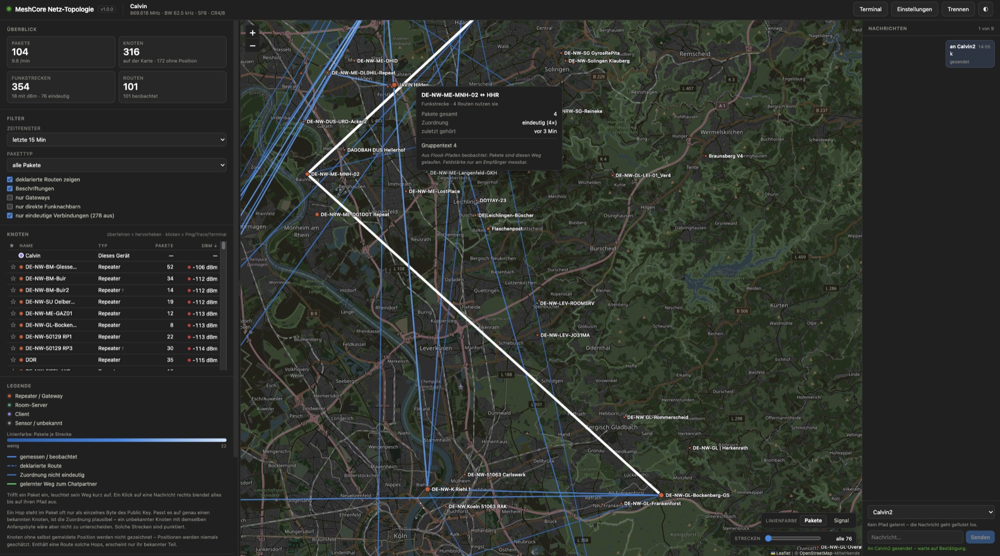

<div align="center">

# MeshCore Netz-Topologie

### Sehen, wie das Funknetz wirklich aussieht

**Eine einzige HTML-Datei. Kein Backend. Die Aufzeichnung verlässt deinen Rechner nie.**

<br>

<a href="https://calkoe.github.io/meshcore-stats/"></a>

<sub>Öffnet die fertige Anwendung direkt – keine Installation, keine Anmeldung.<br>
Zum Mitnehmen: <a href="https://github.com/calkoe/meshcore-stats/releases/latest">die <code>index.html</code> aus dem letzten Release</a>.<br>
Bluetooth gibt es nur in Chrome oder Edge und nur über <code>https</code> oder <code>localhost</code>,
<a href="#grenzen">nicht per Doppelklick</a>.</sub>

<br><br>

[](.github/workflows/build.yml)
[](src)
[](#lizenz)
[](https://github.com/calkoe/meshcore-stats)

<br>



<sub>Funkstrecken im Raum Köln. Dicke und Farbe zeigen das Aufkommen, das Strichbild den Vorbehalt;
der Tooltip nennt Pakete, Zuordnung und wann zuletzt etwas darüber lief.</sub>

</div>

---

## Was die Anwendung leistet

Sie verbindet sich per **Bluetooth Low Energy** mit einem MeshCore-Gerät mit Companion-Firmware und
rekonstruiert daraus die Topologie des Funknetzes. Grundlage ist, dass die Firmware für **jedes
empfangene Funkpaket** ein `PUSH_CODE_LOG_RX_DATA`-Frame mit SNR, RSSI und dem rohen Paket
schickt – noch bevor sie es selbst auswertet. Die App sieht damit den gesamten Verkehr in Hörweite,
nicht nur Textnachrichten: Adverts, ACKs, Requests, Gruppen- und Direktnachrichten, Traces.

Daraus entsteht eine Karte: welche Knoten es gibt, über welche Hops Pakete eintreffen, welche
Strecken die heißen sind und wie stark der Empfang jeweils war. Dazu kommt, was über das Zusehen
hinausgeht – **Ping und Trace** als aktive Messung, ein **Höhenprofil** mit Sichtlinie und
Fresnelzone, die **Konfiguration** des eigenen Geräts samt Kanälen, ein **Terminal** zu fremden
Repeatern und **Chat** mit sichtbarem Weg der Nachricht.

## Was gemessen ist und was nicht

Die Anwendung ist um eine Regel herum gebaut: **lieber eine Lücke zeigen als sie plausibel füllen.**
Das ist kein Stil, sondern Notwendigkeit – die halbe Information in einem Mesh-Netz ist erschlossen,
nicht abgelesen, und auf einer Karte sieht beides gleich aus.

| Herkunft | Bedeutung | Darstellung |
| --- | --- | --- |
| **gemessen** | Letzter Hop zu diesem Gerät – RSSI und SNR liegen wirklich vor | durchgezogen, mit dBm |
| **beobachtet** | Aus Flood-Pfaden: das Paket ist diesen Weg nachweislich gelaufen | durchgezogen, ohne dBm |
| **deklariert** | Direct-Pfad oder `out_path` – das Netz hält den Weg für gültig | lang gestrichelt |
| **nicht eindeutig** | Ein Ende nur über ein einzelnes Byte des Public Key erkannt | fein punktiert |

Der letzte Fall ist der interessanteste. Ein Hop steht im Paket nicht als vollständige Kennung,
sondern als **Prefix des Public Key** – und dessen Länge schwankt je nach `path_hash_mode` des
sendenden Netzes zwischen 1 und 3 Byte, für denselben Knoten auch gemischt. `fd`, `fddc` und
`fddc80` können dasselbe Gerät meinen. Die App löst jeden Hash über die Kontaktliste auf und hält
fest, wie sicher das war: Passt ein **1-Byte-Hash** auf genau einen bekannten Knoten, ist die
Zuordnung plausibel, aber nicht beweisbar – ein *unbekannter* Knoten mit demselben Anfangsbyte wäre
nicht davon zu unterscheiden. Passt ein Hash auf mehrere, wird er **keinem** zugeordnet und bleibt
als `#hash` stehen.

Eine Funkstrecke gilt als eindeutig, sobald **eine** Beobachtung beide Enden zweifelsfrei festlegt.
Der Filter „nur eindeutige Verbindungen" blendet alle übrigen aus; die Kennzahlenleiste weist offen
aus, wie viele das sind.

Ebenso konsequent: **Positionen werden nie geschätzt.** Gezeichnet wird nur, was ein Knoten selbst
per Advert gemeldet hat. Knoten ohne Position erscheinen nicht, Strecken zu ihnen auch nicht – von
einer Route bleibt dann der bekannte Teil. Wie viele Knoten das betrifft, steht in der
Kennzahlenleiste.

## Kernfunktionen

| | |
| --- | --- |
| **Karte** | Knoten nach Typ, Strecken nach Aufkommen. Linienfarbe umschaltbar: **Pakete** oder **gemessenes Signal** in dBm. Trifft ein Paket ein, leuchtet sein Weg kurz auf. |
| **Knotenfenster** | Klick auf einen Knoten – auf der Karte oder in der Tabelle: alle Angaben, Ping, Trace, „Pfad vergessen", und bei Repeatern gleich die Befehlszeile des Knotens. |
| **Streckenfenster** | Klick auf eine Linie: Verkehr und Empfang in Zahlen, Ping und Trace, darunter das Höhenprofil. |
| **Höhenprofil** | Geländeschnitt mit Sichtlinie und erster Fresnelzone, Erdkrümmung mit k = 4/3, 60-%-Kriterium. Antennenhöhe als Eingabe – das Protokoll kennt sie nicht. |
| **Ping** | `CMD_SEND_PATH_DISCOVERY_REQ`, geflutet. Liefert **Hin- und Rückpfad**, die sich unterscheiden können. Kein Login nötig. |
| **Trace** | `CMD_SEND_TRACE_PATH` als Rundweg – liefert das **SNR je Hop**. |
| **Terminal** | Admin-Konsole eines fremden Repeaters: Login mit Passwort, danach Befehle als `TXT_TYPE_CLI_DATA`, mit Befehlshistorie. |
| **Einstellungen** | Name, Position, Uhr, Advert · Funkparameter mit Rückfrage alt→neu · Path-Hash-Modus, Telemetrie, Zeitverhalten · Kanäle · Neustart, PIN, Werksreset. |
| **Nachrichten** | Empfangen und senden, Favoriten oben. Bei gewähltem Empfänger nur dieser Verlauf; der gelernte Weg dorthin liegt grün mit Pfeilen auf der Karte und lässt sich von hier aus verwerfen. |
| **Nachrichtenpfad** | Klick auf eine Nachricht blendet alles bis auf ihren Weg aus – gekennzeichnet als *zugeordnet, nicht abgelesen*, denn im Frame steht er nicht. |
| **Filter** | Zeitfenster von einer Minute bis alles, Pakettyp, nur Gateways, nur direkte Funknachbarn, nur eindeutige Verbindungen, Schwelle auf die verkehrsreichsten Strecken. |
| **Daten** | Aufzeichnung im `localStorage`, Export und Import als JSON. „Nur Verkehr verwerfen" behält die Kontakte. |

## Bedienung in 60 Sekunden

1. **Verbinden** oben rechts. Beim ersten Mal fragt das Betriebssystem nach der BLE-PIN des Geräts
   (Standard bei MeshCore: `123456`).
2. Die Karte füllt sich von selbst – jedes gehörte Paket zählt. Ohne Verkehr bleibt sie leer; das
   ist kein Fehler, sondern ein stilles Netz.
3. **Klick auf einen Knoten** öffnet sein Fenster mit Ping, Trace und Terminal. **Klick auf eine
   Linie** öffnet Statistik und Höhenprofil. Bloßes Überfahren zeigt nur den Tooltip, ein Klick ins
   Leere schließt wieder.
4. Rechts einen **Empfänger** wählen: der Verlauf mit ihm bleibt stehen, sein gelernter Weg
   erscheint grün auf der Karte.
5. Unten rechts die **Linienfarbe** zwischen *Pakete* und *Signal* umschalten und mit dem Regler
   daneben auf die verkehrsreichsten Strecken eindampfen.

## Selbst bauen

```bash
npm install
npm run dev       # Entwicklungsserver
npm test          # Protokoll-, Modell- und Funkphysik-Tests
npm run build     # erzeugt dist/index.html – die fertige Anwendung
```

Veröffentlicht wird ausschließlich über Versionstags. Die CI prüft, dass der Tag die Form `vN.N.N`
hat, auf `main` sitzt, zur `version` in `package.json` passt und höher ist als der letzte – erst dann
landet die gebaute Datei in GitHub Pages und im Release.

```bash
# Version in package.json anheben, committen, dann:
git tag v1.1.0 && git push origin v1.1.0
```

Der Einstieg in den Code ist **[ARCHITEKTUR.md](ARCHITEKTUR.md)**.

```
src/
  protocol/    Companion-Protokoll: Konstanten, Frame-Parser, Kommando-Builder
  model/       Topologie, aus einem Ereignis-Log abgeleitet
  transport/   Web Bluetooth (Nordic UART Service)
  state/       Verdrahtung Gerät und Modell, Einstellungen, React-Anbindung
  map/         Leaflet-Karte, Farbskalen, Höhenprofil-Berechnung
  ui/          Oberfläche
```

Sämtliche Byte-Layouts sind gegen die Firmware-Quellen verifiziert (`MyMesh.cpp`, `NodePrefs.h`,
`Dispatcher.cpp`, `Packet.h`, `Mesh.cpp`, `AdvertDataHelpers.*`, `CommonCLI.cpp`, `Identity.h`) und
im Quelltext mit Fundstelle kommentiert. Ein Debug-Zugang liegt auf `window.meshcoreTopo`.

## Grenzen

- **Web Bluetooth** gibt es nur in Chrome und Edge am Rechner, und nur im sicheren Kontext
  (`https://` oder `http://localhost`). Ein Doppelklick auf die heruntergeladene Datei landet auf
  `file://` und genügt dafür nicht.
- **Zwei fremde Hosts** werden zur Laufzeit angesprochen, beide unvermeidlich:
  `tile.openstreetmap.org` für die Kartenkacheln – eine Weltkarte lässt sich nicht einbetten – und
  `api.open-meteo.com` für die Geländehöhen, und das nur beim Öffnen eines Höhenprofils. Der
  Build-Workflow prüft, dass keine weiteren hinzukommen.
- **Das Höhenmodell kennt kein Gebäude und keinen Baum** (90-m-Raster). Ein „Sichtlinie frei" ist
  deshalb kein Versprechen.
- **Der Pfad einer empfangenen Nachricht ist erschlossen**, nicht abgelesen: das Frame nennt nur die
  Hop-Zahl, die Kette stammt aus dem RX-Protokoll.
- **Favoriten liegen im Browser**, nicht im Gerät – die Firmware kennt keine.
- **Kanäle** haben keinen Löschbefehl; ein freier Platz ist ein überschriebener. Der
  128-Bit-Schlüssel wird nicht aus einem Passwort abgeleitet, sondern als 32 Hex-Zeichen eingetragen
  oder gewürfelt.
- **Nachrichten holt die App aus der Warteschlange des Geräts** (`CMD_SYNC_NEXT_MESSAGE`). Eine
  parallel laufende Chat-App sieht sie danach nicht mehr.
- **Adverts aus dem RX-Log werden nicht signaturgeprüft**; die Firmware prüft nur, was sie selbst als
  Kontakt übernimmt.

## Lizenz

MIT – siehe [LICENSE](LICENSE).
